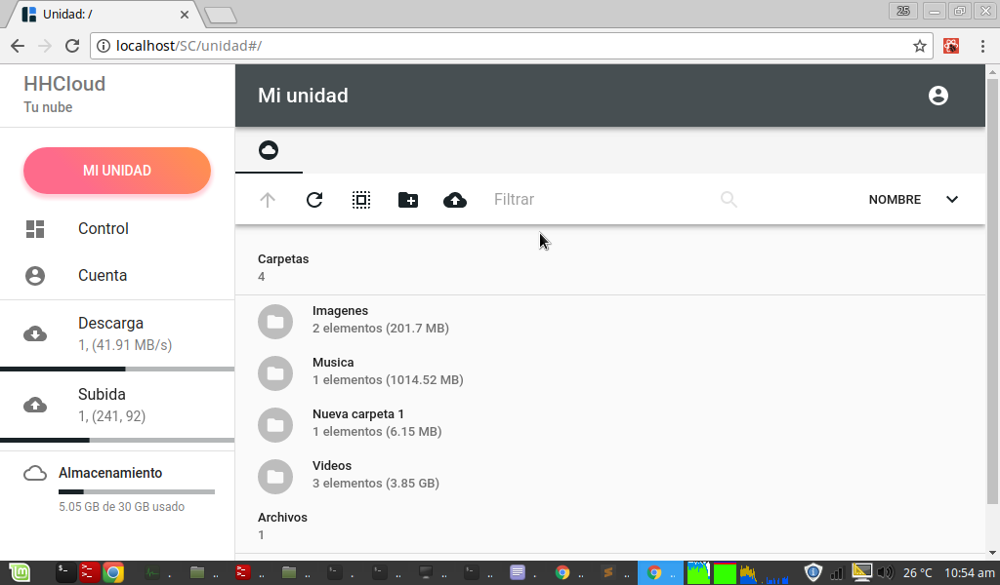

HHCloud interfaz web
==========

__HHCloud__ te permite crear una nube de almacenamiento sumamente facil y rapido, con poca configuracion, haciendo uso de su [interfaz web](https://github.com/Davidc2525/HHCloud), se complementan para poder prestar el servicio, HHCloud consta de 2 partes:

- [Servidor](https://github.com/Davidc2525/HHCloudBackend): Gestiona las peticiones de el cliente.
- Cliente: Tiene La interfaz adactada a las prestaciones del servidor.

Instalacion y uso

```
$ git clone https://github.com/Davidc2525/HHCloud.git
$ cd HHCloud
$ npm install
$ npm run build-client
$ node src/server/index.js
```
luego en tu navegador -> [http://localhost](http://localhost)

Imagen de presentacion
======================


