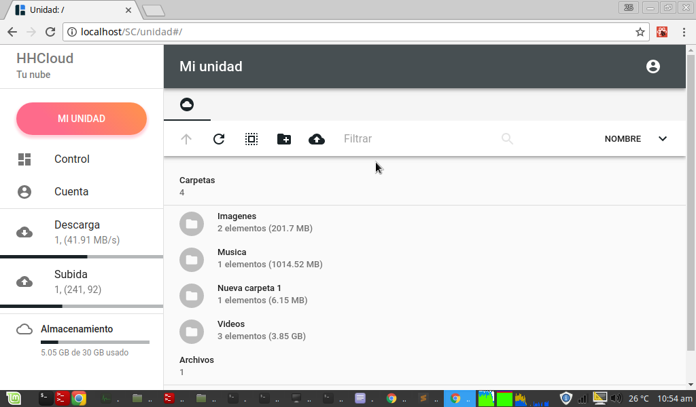

HHCloud applicacion web
=======================

```
$ git clone https://github.com/Davidc2525/HHCloud.git

$ cd HHCloud

$ npm install

$ npm run build-client

$ node src/server/index.js

en tu navegador -> http://localhost
```

Imagen de presentacion
======================

